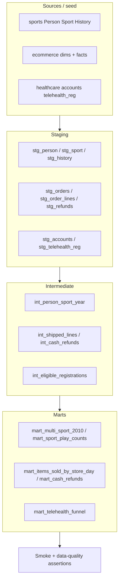

# dbt-style layering (conceptual)

This repo is plain SQL + Postgres seeds—not a dbt project. The smoke domains still follow the same **layer contract** analytics engineers use in dbt: raw sources stay untouched, staging cleans them, intermediate models encode joins/business rules, and marts expose metrics that tests assert.

## Layer rules

| Layer | Owns | Does not |
|-------|------|----------|
| **Source** | Exact seed/schema tables in `docker/init/` | Renames, filters, or metric logic |
| **Staging** | 1:1 cleanup: rename, cast, light dedupe | Multi-table business joins |
| **Intermediate** | Reusable join graphs and rule filters | Final dashboard grain |
| **Mart** | One business grain / KPI surface | Raw column dumps |

## Domain mapping

### Sports league

| Layer | Conceptual model | Grain | Built from |
|-------|------------------|-------|------------|
| Source | `Person`, `Sport`, `History` | as seeded | `01_schema.sql` / `02_seed.sql` |
| Staging | `stg_history` | one play event | History + typed year |
| Intermediate | `int_person_sport_year` | person × sport × year | History ⨝ Person ⨝ Sport |
| Mart | multi-sport participants (Q1); unused sports (Q2); play counts incl. zeros (Q3) | person or sport | asserted in `tests/sports_smoke.sql` |

Illustrative SQL: [`sql/layers/sports_layers.sql`](../sql/layers/sports_layers.sql).

### Ecommerce orders

| Layer | Conceptual model | Grain | Built from |
|-------|------------------|-------|------------|
| Source | `dim_*`, `fact_order`, `fact_order_line`, `fact_refund` | as seeded | `03`/`04` init scripts |
| Staging | `stg_order_lines`, `stg_refunds` | line / refund | facts + label joins |
| Intermediate | shipped successful non-upsell lines; cash refunds on credit billing | filtered fact rows | status + type rules |
| Mart | items sold by store/day/type; cash refund by order | store×date×type; order | `tests/ecommerce_smoke.sql` |

Illustrative SQL: [`sql/layers/ecommerce_layers.sql`](../sql/layers/ecommerce_layers.sql).

### Healthcare scheduling

| Layer | Conceptual model | Grain | Built from |
|-------|------------------|-------|------------|
| Source | `accounts`, `telehealth_reg` | as seeded | `05`/`06` init scripts |
| Staging | `stg_accounts`, `stg_telehealth_reg` | account / registration | dates as `DATE` |
| Intermediate | eligible accounts left-joined to registration; latency days | account | eligibility + reg |
| Mart | prior-year account count; eligible reg rate; median latency | cohort / scalar KPI | `tests/healthcare_smoke.sql` (as-of `2019-01-01`) |

Illustrative SQL: [`sql/layers/healthcare_layers.sql`](../sql/layers/healthcare_layers.sql).

## Tests mirror dbt data tests

`tests/data_quality_smoke.sql` plays the role of dbt `unique` / `not_null` / `relationships` / `accepted_values` / expression tests on the **source** tables that feed every layer. Domain smoke files then assert **mart** outputs (KPI correctness).

| dbt-style test | What smoke checks |
|----------------|-------------------|
| `unique` + `not_null` on PK | No duplicate / null keys on Person, Sport, dims, facts, accounts |
| `relationships` | History → Person/Sport; order lines/refunds → orders; telehealth_reg → accounts |
| `accepted_values` | Product types, refund types, line status codes |
| Expression | Refunds ≥ 0; registration date ≥ account created date; History.Score ≥ 0 |

Run via `./scripts/smoke.sh` (Docker Compose preferred).

## Why document this without installing dbt

- Keeps the repo clone-and-smoke simple (Postgres only).
- Still shows how warehouse SQL would be packaged as `stg_` / `int_` / `mart_` models and tested.
- Layer SQL under `sql/layers/` is readable reference—not executed by Compose init—so seeds stay the single source of truth.
